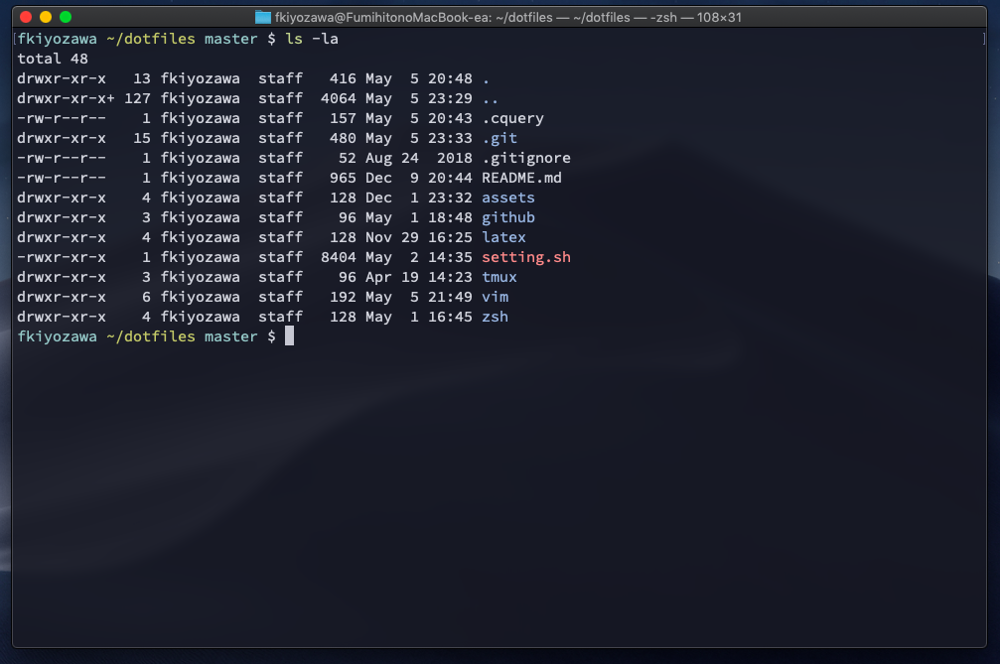
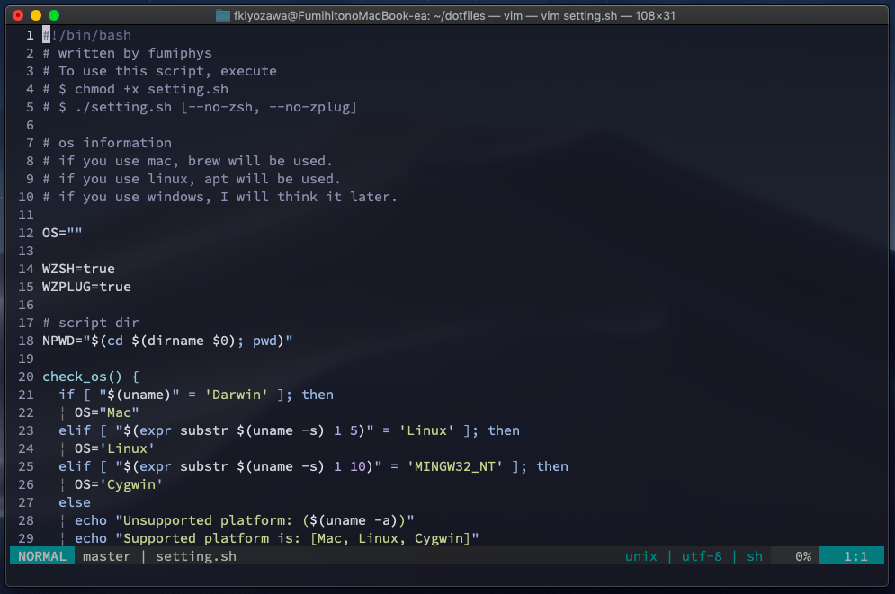
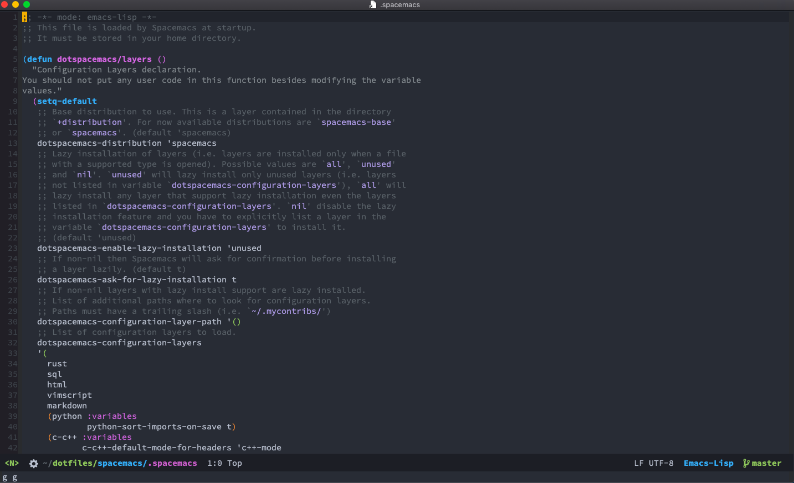

# dotfiles
dotfiles

This repository is now being reconstructed. To use old version, use branch 'clean'.

## supported platform (for now)
 - Mac os X
 - Ubuntu

# Screen Shots




## use (installation)
### requirements
  - homebrew (Mac os X)
  - apt (Ubuntu)

To use zplug, you should install zplug. (see --no-zplug option)
```
curl -sL --proto-redir -all,https https://raw.githubusercontent.com/zplug/installer/master/installer.zsh| zsh
```
Execute setting.sh
```
chmod +x setting.sh
./setting.sh [--no-zsh] [--no-zplug]
```
  |option|about|
  |:---:|:---:|
  |--no-zsh|do not use zshrc|
  |--no-zplug|do not install zplug|
  |--spacemacs|spacemacs setting only|
  
and then, rewrite vim/conf.d/plugins/dein_lazy.toml
```
let g:deoplete#sources#jedi#python_path = `which python3`
```
(This will be written in setting.sh later.)

## detail
 - [vim](vim/)
 - [zsh](zsh/)
 - [github](github/)
 - [latex](latex/)
 - [vscode](vscode/)

## TODO
 - vim
 - latex
 - (tmux?)
